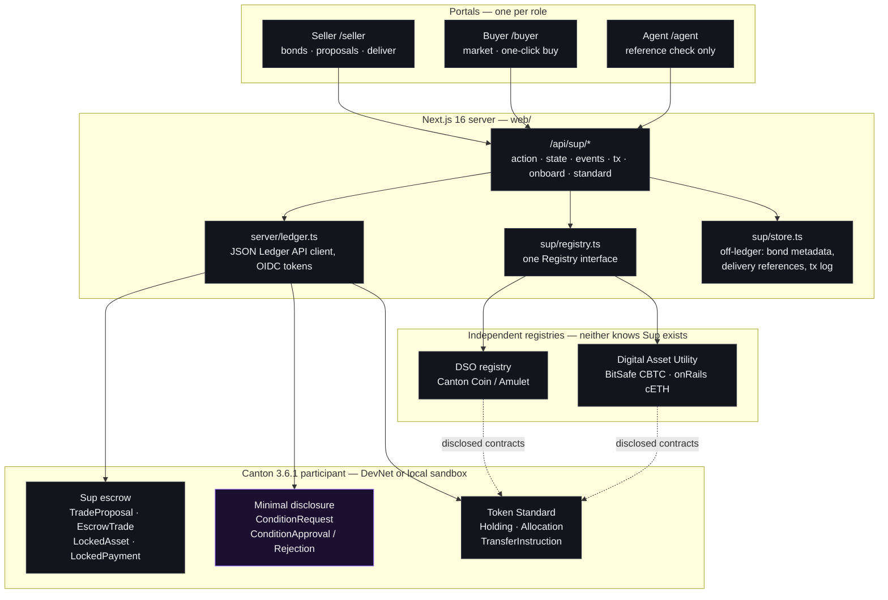
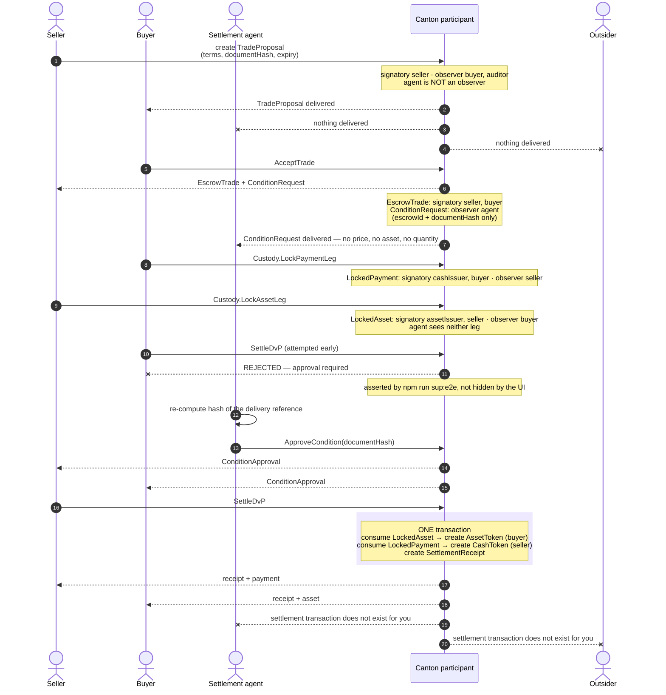
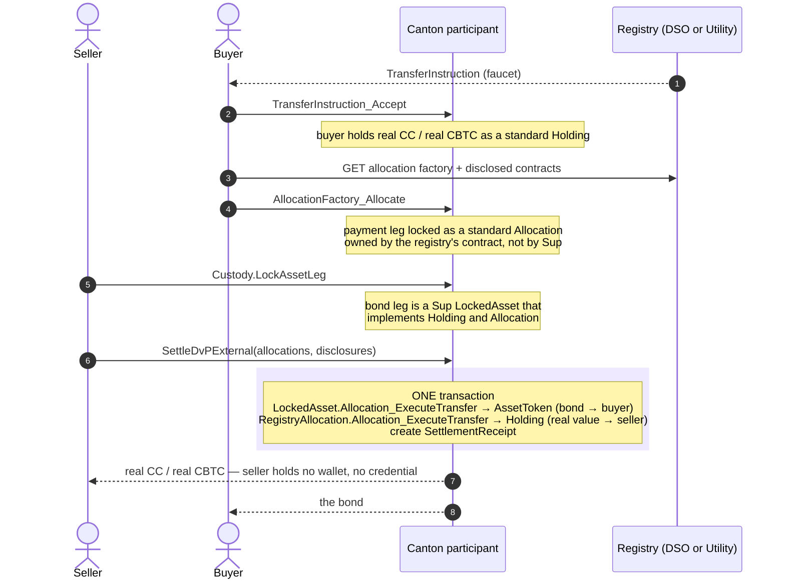

# Sup - confidential OTC settlement desk for tokenized bonds - atomic delivery-versus-payment against cBTC and Canton Coin, with a settlement agent that never sees the trade

> **Settlement that proves delivery without exposing the trade.**

**HackCanton Season 3 · Track 2 — Financial Applications**  ·  [Pitch](PITCH.md)  ·  [Demo script](docs/demo-script.md)  ·  [Docs](docs/sup/README.md)  ·  [Deploy](docs/deploy.md)

---

## Introduction

When two institutions trade a tokenized asset — a bond, a fund unit, a private-credit position — someone has to confirm that the asset really was delivered, and release the payment only then. That someone is a settlement agent: a custodian, a fund administrator, a document checker.

Today that step breaks in one of two ways. **On a public chain**, the trade is visible to everyone: price, size and both counterparties are exposed the moment it settles, and often before. For a block trade, the *fact of the trade* moves the market. **Off-chain**, privacy is bought by handing the agent everything — price, quantity, both names — although all it must confirm is one fact: *was the delivery reference valid?* And payment and delivery remain two separate movements in two separate systems, reconciled afterwards. The gap between them is where settlement risk lives.

So the choice institutions face is between exposing the trade and trusting a third party with all of it.

**Sup removes the choice.** A seller sends private terms to one named buyer. The buyer pays into escrow. The settlement agent is handed a trade reference and a document fingerprint — and nothing else, because the contract carrying the price is one Canton never delivers to it. When the agent confirms, asset and payment swap in a **single Canton transaction**: both legs, or neither.

It is not a mock. Every claim below is checked against a **live Canton 3.6.1 ledger** — the shared HackCanton DevNet participant — and a trade has settled there against **real Canton Coin** and **real BitSafe CBTC**, in one transaction, invisible to the agent and to an outsider.

### In four lines

- **Private by construction.** The agent is not an observer of the trade. Its dashboard cannot show the price, because the price never arrived.
- **Atomic by construction.** One transaction consumes both locked legs and creates both deliveries. There is no half-settled state and nothing to reconcile.
- **Standard by construction.** Sup's legs are Canton Token Standard `Holding`s and `Allocation`s, so it settles against registries that have never heard of Sup.
- **Proven, not promised.** 14 Daml scripts · 46 deliberate-rejection checks · 4 live-ledger suites · 38 settled trades on DevNet · two real-asset settlements with transaction hashes.

---

## The claim, and how it is checked

> Given a seller, a buyer, a settlement agent, a tokenized asset and a payment token, Sup keeps the trade private, locks both legs, and delivers asset-for-payment atomically in one Canton transaction.

That is asserted, not described. `npm run sup:e2e` runs the full lifecycle against a live ledger and **fails** if any privacy or atomicity property does not hold — including by submitting the settlement command that the UI hides, and requiring the ledger itself to refuse it.

---

## Architecture

Three layers, and the privacy boundary runs through the middle one. The browser never talks to the ledger: a Next.js server holds the ledger client, and the Daml contracts decide who is told what.



**What to notice.** `ConditionRequest` (highlighted) is a *separate contract* from `EscrowTrade`. That is the whole privacy design in one line: the agent is an observer of the request and not of the trade, so the Canton protocol never ships it the commercial terms. The off-ledger store holds only what must not be on a ledger — the original delivery reference, whose hash alone is on-chain — and bond display metadata.

Full write-up: [docs/sup/architecture.md](docs/sup/architecture.md) · [docs/sup/privacy.md](docs/sup/privacy.md).

---

## The lifecycle, as a sequence

The happy path with an agent involved. Every arrow is a real Canton command; every `Note` is a visibility fact enforced by the ledger, not by the app.



**Settling against a real external registry** uses the same shape, with `SettleDvPExternal` in place of `SettleDvP`. Sup's own allocation and the registry's allocation execute inside one transaction:



Detail: [docs/sup/settlement.md](docs/sup/settlement.md) · [docs/sup/token-standard.md](docs/sup/token-standard.md).

---

## What makes it a Canton product

**1. The settlement agent is told the minimum.** A custodian or document checker has to confirm one fact — not learn the price. The agent is deliberately *not* an observer of the trade. It receives a `ConditionRequest` containing a trade reference and a document hash, and nothing else. Price, asset and quantity live on a contract Canton never delivers to it.

```
agent cannot see the escrow trade (no price, no asset, no quantity)
agent sees only the condition request
agent cannot see the locked legs                       ← asserted in the Daml tests and on DevNet
```

**2. Settlement is one transaction.** Both locked legs are consumed and both deliveries are created together. There is no window in which one side has delivered and the other has not. Each step is its own transaction, and **Verify** reads it back from the node as the signed-in party. For a party that was not on the trade the node returns nothing: "this transaction does not exist for you".

**3. It speaks the Canton Token Standard (CIP-56).** Sup's tokens are standard `Holding`s, its escrow legs are standard `Allocation`s, and a trade can settle against **real Canton Coin** from the DSO's registry or **real BitSafe CBTC** from the Digital Asset Utility registry, in one transaction with Sup's bond. **Two independent registries, through one code path** — which is the evidence that the pattern generalises rather than being hardcoded to one asset.

### Why this is not portable to a shared-state chain

There, "the agent should not see the price" is a *request*: the data is on the ledger and the agent can read it. On Canton it is a *property of the contract* — visibility is declared in Daml as signatories and observers, and the protocol delivers a contract only to those parties. And bilateral off-chain settlement cannot make payment and delivery atomic across two issuers. Both properties together need a ledger where visibility and atomicity are part of the contract.

---

## Proof: the privacy matrix, read off the source

Not a diagram of intent — this is `signatory` / `observer` as written in [daml/sup/daml/Sup/Escrow.daml](daml/sup/daml/Sup/Escrow.daml), and it is what the protocol enforces.

| Contract | Seller | Buyer | **Agent** | Auditor | Outsider |
|---|:--:|:--:|:--:|:--:|:--:|
| `TradeProposal` — terms, price, hash | ✅ signatory | ✅ observer | ❌ | ✅ opt-in | ❌ |
| `EscrowTrade` — the binding trade | ✅ signatory | ✅ signatory | ❌ | ✅ opt-in | ❌ |
| `LockedAsset` — asset leg + quantity | ✅ signatory | ✅ observer | ❌ | ❌ | ❌ |
| `LockedPayment` — cash leg + amount | ✅ observer | ✅ signatory | ❌ | ❌ | ❌ |
| `ConditionRequest` — **id + hash only** | ✅ signatory | ✅ signatory | ✅ **observer** | ❌ | ❌ |
| `ConditionApproval` / `Rejection` | ✅ observer | ✅ observer | ✅ signatory | ❌ | ❌ |
| `SettlementReceipt` | ✅ signatory | ✅ signatory | ❌ | ✅ opt-in | ❌ |

The agent's single ✅ is on the one contract that carries no commercial field. That is the product.

---

## Proof: deployed on Canton DevNet

Live on the shared HackCanton participant (`ledger-api-json.participant.hackcanton-01.devnet.naas.noders.services`, Canton 3.6.1), namespace `2ee903ba-`.

| Package | Id | Notes |
|---|---|---|
| `sup` 0.3.0 | `98e74b823b59e9a07540f6b36d45ba23ffed046591cc7a834a953cdeff0b1db7` | Token Standard holdings + allocations, `SettleDvPExternal` |

Parties (all with `can-act-as`): `sup-seller`, `sup-buyer`, `sup-agent`, `sup-auditor`, `sup-asset-issuer`, `sup-cash-issuer`, `sup-outsider`.

**An atomic settlement, captured on DevNet** (offset 2698502):

```
12208c650f6101cf38e81193d5eba8cb76bec396aa2d9d5e501428692f71fab8e93c
  EscrowTrade.SettleDvP                    consuming
    LockedAsset.ReleaseAssetTo             consuming  →  create AssetToken   (buyer)
    LockedPayment.ReleasePaymentTo         consuming  →  create CashToken    (seller)
  create SettlementReceipt
```

**Real Canton Coin, through the standard registry, on DevNet** — each step committed on the shared node:

| Step | Update id | Result |
|---|---|---|
| `TransferInstruction_Accept` | `1220202cda6bc0554fe642dc4b35a47c79b5f2ab9f88acfc4081024462a96830086d` | `sup-buyer` holds 3,000 real CC (`Splice.Amulet:Amulet`) |
| `AllocationFactory_Allocate` | `1220abe187bc9778381d3fc081ee5e32cea1293a35302d18b3d3a6e34eb9361b3608` | 250 CC locked in a `Splice.AmuletAllocation` |
| `Allocation_ExecuteTransfer` | `1220529c88f4958dd7a77af9fde4e785f374b3a80d8e2c9da531c2d4b0812c11a932` | `sup-seller` (no wallet) receives 250 CC |

**A Sup trade settled in real Canton Coin, in one transaction** (`npm run sup:e2e:amulet`, 19 checks, passing on DevNet) — Sup's bond allocation and the DSO registry's Amulet allocation execute together:

```
12203a6f3f48c035828dc668a048d931baa41c56c6b13aa3024d8573098f5ca64f6f   (DevNet offset 2705360)
  EscrowTrade.SettleDvPExternal
    LockedAsset.Allocation_ExecuteTransfer          →  create AssetToken        (bond → buyer)
    AmuletAllocation.Allocation_ExecuteTransfer                                   (the DSO registry's contract)
      LockedAmulet.LockedAmulet_UnlockV2            →  create Amulet            (250 real CC → seller)
  create SettlementReceipt
```
Visible to the buyer and the seller; **not** to the settlement agent or the outsider (checked against the node).

**A Sup trade settled in real BitSafe CBTC, in one transaction** (`npm run sup:e2e:cbtc`, passing on DevNet) — a different registry, the same code path. The seller, a party with no wallet and no credential, received the CBTC:

```
1220b7897407c4dcca746911ed4df6153b3d9ff330d519fab7d36c592e4d1f2fdc65   (DevNet offset 2759757)
  EscrowTrade.SettleDvPExternal
    LockedAsset.Allocation_ExecuteTransfer          →  create AssetToken   (bond → buyer)
    DvpLegAllocation.Allocation_ExecuteTransfer                              (BitSafe's registry)
      TransferRule.TransferRule_ExecuteAllocation   →  create Holding      (real CBTC → seller)
  create SettlementReceipt
```

---

## Proof: the test evidence

| Layer | What it is | Result |
|---|---|---|
| Daml Script | **14 scripts, 46 deliberate-rejection checks** across [`daml/sup-test/`](daml/sup-test/daml/) | all passing |
| Live ledger — test tokens | `npm run sup:e2e` — propose → accept → lock both legs → approval → atomic settle, plus every privacy assertion | passing on DevNet |
| Live ledger — Canton Coin | `npm run sup:e2e:amulet` — **19 checks**, faucet → accept → allocate → execute, then a Sup trade settled in real CC | passing on DevNet |
| Live ledger — BitSafe CBTC | `npm run sup:e2e:cbtc` — the same flow through a second, independent registry | passing on DevNet |
| Live ledger — portal flows | `npm run sup:e2e:portal` — seller-defined bonds, one-click buy and deliver, the reference check | passing on DevNet |
| On-ledger volume | settled `SettlementReceipt` contracts, counted from the seller's view | **38 trades**: 24 `CashUSD`, 4 real CC, 10 real CBTC |

The 46 rejection checks each try a forbidden action and **require the ledger to refuse it**: wrong asset class, short quantity, wrong currency, a non-agent approving, an outsider settling, one party springing a locked leg, an approval borrowed from a different trade, an allocation that does not match the trade, settlement before approval, settlement after expiry.

### Bugs this testing actually caught

Evidence is only worth something if it changed the product:

- A test submitted settlement **straight to the ledger** and proved the ledger itself refuses it without approval. We then **removed a README claim** that had only ever been checked at the app level.
- The agent could not actually verify the document it was asked to approve. We added a reference check: the agent re-computes the fingerprint and approval unlocks **only on a match**.
- A balance bug — the faucet's locked holding counted as the buyer's — was caught by the CBTC suite and fixed.
- Users could not follow the first interface, so we rebuilt it as **separate seller, buyer and agent portals** with one-click buy and deliver.

---

## The contracts

12 Daml templates, 1,479 lines of Daml including tests. Deliberately small: every template exists because a privacy or atomicity property needs it.

| Template | Purpose |
|---|---|
| `Custody` | issuer→owner delegation; a choice here carries **both** authorities, which is what lets a lock be co-signed |
| `CustodyInvite` | opens a custody account on-chain |
| `TradeProposal` | private terms to one named buyer; `WithdrawProposal`, `RejectProposal`, `AcceptTrade` |
| `EscrowTrade` | the binding trade. `SettleDvP`, `SettleDvPExternal`, `CancelByAgreement`, `CloseExpired` |
| `LockedAsset` | the asset leg. **`interface instance Holding` + `Allocation`** — standard-shaped, so a registry can drive it |
| `LockedPayment` | the cash leg, likewise a standard `Holding` and `Allocation` |
| `ConditionRequest` | the **minimal-disclosure** contract: `escrowId` + `documentHash`, observed by the agent |
| `ConditionApproval` / `ConditionRejection` | the agent's verdict, signed by the agent |
| `SettlementReceipt` | terminal outcome: settled, cancelled or expired |
| `AssetToken` / `CashToken` | delivered holdings |

---

## Run it

Prereqs: Node 20+, JDK 21, [dpm](https://docs.digitalasset.com).

```bash
# contracts + tests (14 Daml scripts, 46 deliberate-rejection checks)
cd daml/sup && dpm build && cd ../sup-test && dpm test

# local ledger
./scripts/start-ledger.sh

# app
cd web && cp .env.example .env.local && npm install && npm run dev        # http://localhost:3000
npm run sup:e2e                              # full lifecycle + every privacy assertion
```

On the shared DevNet node, see [docs/devnet.md](docs/devnet.md), then `npm run sup:devnet` (preflight), `npm run sup:e2e:amulet` (settles in real Canton Coin), `npm run sup:e2e:cbtc` (settles in real CBTC) and `npm run sup:e2e:portal` (bonds, one-click buy and deliver, the reference check). `npm run sup:seed:market` fills the market with bonds and open offers in every currency.

Credentials live only in environment variables. `.env.local` is never committed; only `.env.example` is.

**Demo video.** `web/scripts/demo/` drives the real app with a visible cursor, cuts the ledger waits and mixes in neural-voice narration (`pip install edge-tts`, then `npm run demo:tts`, `demo:record`, `demo:build`). **Deploying:** [docs/deploy.md](docs/deploy.md).

---

## Demo path

1. **Seller** (`/seller`): create or pick a bond, then **New proposal**. Price it in `CashUSD`, **real Canton Coin** or **real CBTC**; optionally ask an agent to confirm delivery.
2. **Buyer** (`/buyer`): the market ranks open offers by price per unit. **Buy** accepts the offer and locks the payment in one click.
3. **Seller**: **Deliver bond** locks the bond. If no agent is involved, the trade settles in the same step.
4. **Agent** (`/agent`, only when requested): paste the delivery reference. The app hashes it and compares it with the fingerprint on the ledger; **Confirm delivery** unlocks only on a match, and the trade settles.
5. Open the trade, then **Verify**: each step is read back from the node as you, and the same transaction is invisible to anyone who is not a party to it.

Settlement stays blocked until the agent approves. The UI hides the button; `npm run sup:e2e` submits the settlement anyway and asserts the ledger rejects it.

### Roles

| Party | Role |
|---|---|
| Seller | defines bonds, sells the tokenized asset |
| Buyer | pays against delivery |
| Agent | optional settlement agent, verifies a delivery reference, sees nothing else |
| Auditor | opt-in auditor, terms and receipts only |
| Bond registry / Cash issuer | issuers of the test asset and test cash; co-sign custody |
| Outsider | unrelated participant, sees nothing |

---

## Why this matters, and why now

**The activity is large and privacy-sensitive.** US corporate debt outstanding is about **$12.1 trillion** (Q2 2026), trading an average of **$66.7 billion a day** (YTD through September 2026) — [SIFMA](https://www.sifma.org/research/statistics/us-corporate-bonds-statistics).

**Leakage is documented, not hypothetical.** A 2026 Tradeweb paper on US credit finds that all-to-all RFQ trading leaks more information than comparable bilateral trades — [Tradeweb](https://www.tradeweb.com/newsroom/media-center/insights/blog/information-leakage-in-us-credit-evidence-from-all-to-all-rfqs/). It is a platform operator's paper, so it is indicative, not independent proof. **We have not measured the dollar cost of leakage per trade and we do not claim one.**

**Why now.** On **December 17, 2025** DTCC announced a partnership with Digital Asset to tokenize a subset of US Treasuries held at its DTC subsidiary **on the Canton Network**, after the SEC issued DTC a no-action letter (December 11, 2025) allowing a three-year tokenization pilot. Real instruments are arriving on this ledger. And the **Canton Token Standard (CIP-56)** now lets a bond and real CBTC or Canton Coin move in one atomic transaction — which Sup does today on DevNet.

### Who it is for

**Primary: the operations team of a broker, fund administrator or transfer agent that settles institutional trades in tokenized funds, bonds or private credit.** They share three traits: they already run a settlement-confirmation step with a named third party; their clients treat price and counterparty as confidential; and they carry the reconciliation and break-management cost of payment and delivery settling separately.

**Not our user:** retail traders, anyone wanting a public order book, anyone who needs price discovery. **Sup begins after two parties have agreed a price.** It is the settlement layer, not a venue.

### Go to market

**Wedge: replace the confirmation-and-reconciliation step for one desk's trades in one tokenized instrument.**

1. **Design partner (0–3 months).** One administrator or broker and two counterparties it already settles for. Sup replaces the email-and-spreadsheet confirmation. A closed network — which is exactly how the contracts model it.
2. **Agent pull (3–9 months).** Every trade names a settlement agent. An agent that gets one workflow with zero commercial exposure has a reason to require it from its other clients.
3. **Platform (9–18 months).** More instruments, netting, multi-leg settlement, and registry integrations as real tokenized assets arrive on Canton.

**Business model:** a per-settlement fee, charged when the transaction commits — the only moment value is created.

**North-star metric:** atomic settlements per week in which the confirming agent saw only a fingerprint. It grows only if desks send real trades through the private path.

---

## What is real, and what is not

| | |
|---|---|
| Ledger, transactions, privacy | **Real** — Canton 3.6.1; visibility checked per party |
| Canton Token Standard interfaces | **Real** — the exact packages vetted on the DevNet node |
| Canton Coin payment | **Real** — DSO registry, real allocations and transfer instructions (DevNet CC) |
| `BOND-2031`, `CashUSD` | **Test assets** issued by demo parties — standard-shaped, not a security, not cash |
| BitSafe CBTC | **Real** — DevNet CBTC from BitSafe's faucet, settled through the Digital Asset Utility registry (small amounts: the faucet gives 0.01 to 1 per request) |
| onRails cETH | **Configured, untested** — same code path as CBTC; no known way to obtain DevNet cETH yet |
| Wallet | A Canton wallet can be connected (CIP-0103 dApp SDK) to identify the user. Trades are still submitted by custodial demo parties, because a wallet's own participant does not host Sup's contracts |

### Honest limitations

- **Not validated with users.** We have not interviewed settlement-operations teams, so we do not know their actual break rates and we **make no claim about savings**. That is the first thing we would do with a design partner.
- An external payment lock (Canton Coin) is defined by its registry: the sender can withdraw it. The seller's exposure is that settlement can *fail*, not that value is lost — settlement is atomic, and the bond stays locked until expiry.
- The issuers co-sign the locked legs, so they learn that a lock exists and for how much.
- The backend is a **custodial demo wallet**. There is no end-user signing and no Grofty/CIP-0103 signing integration; per-party signing is the first post-hackathon milestone.
- Prototype only: no legal title transfer, no production custody, no compliance layer.
- The off-ledger store is a single JSON file — right for one server process, not for a multi-instance deployment.

Full list: [docs/sup/limitations.md](docs/sup/limitations.md).

---

## Repository

```
daml/sup, daml/sup-test    Sup contracts and Daml Script tests
web/                       Next.js 16 app: UI + server-side ledger client
docs/sup/                  architecture, privacy, settlement, token standard, limitations
docs/devnet.md             setting up the shared DevNet node
docs/deploy.md             hosting the app (Render, access code, what survives a restart)
media/                     pitch deck (PDF) and pitch film
render.yaml                Render blueprint
scripts/start-ledger.sh    local Canton sandbox
```

---

## The ask

An introduction to **one tokenized-fund administrator or broker** that settles institutional trades today, and **one settlement agent** willing to review exactly what it would see.

> **Sup: the agent confirms the delivery. It never learns the trade.**
